# Perfessor

<div>
  
</div>

---

A comprehensive web-based visualization tool for GPU performance profiling. Analyze **PyTorch profiler traces** and **NVIDIA Nsight Compute (`.ncu-rep`) reports** entirely in the browser — no server, no install required.

**🌐 Live Demo**: [https://kapilsharma.dev/perfessor/](https://kapilsharma.dev/perfessor/)


## Usage

### PyTorch Trace Demo

<div align="center">
  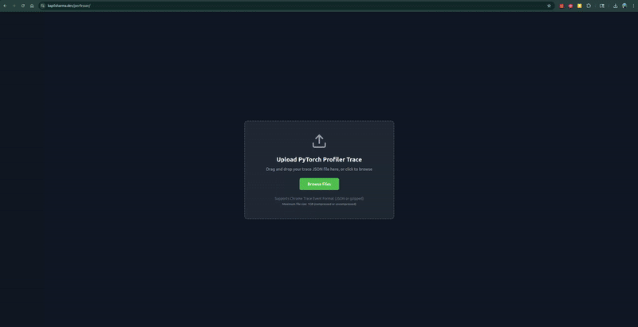
</div>

### PyTorch Trace Screenshots

<div align="center">
  <table>
    <tr>
      <td align="center">
        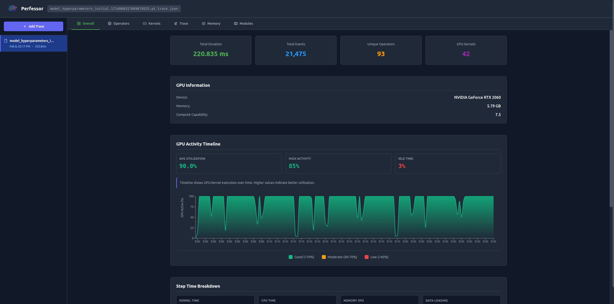<br/>
        <b>PyTorch Overview</b>
      </td>
      <td align="center">
        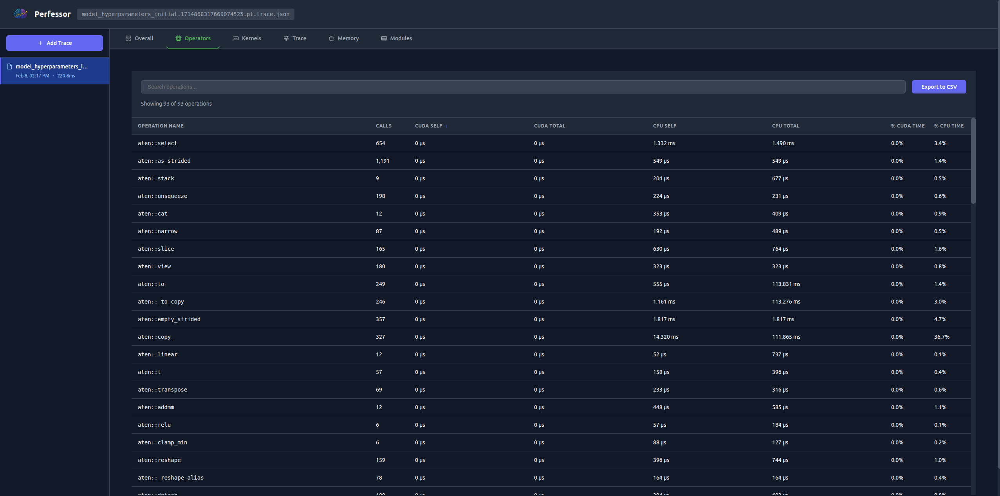<br/>
        <b>Operators View</b>
      </td>
    </tr>
    <tr>
      <td align="center">
        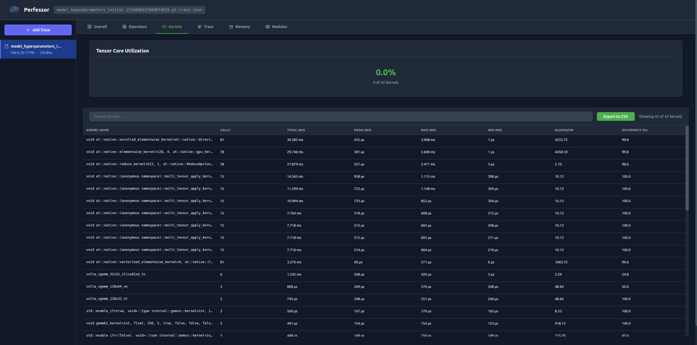<br/>
        <b>Kernels View</b>
      </td>
      <td align="center">
        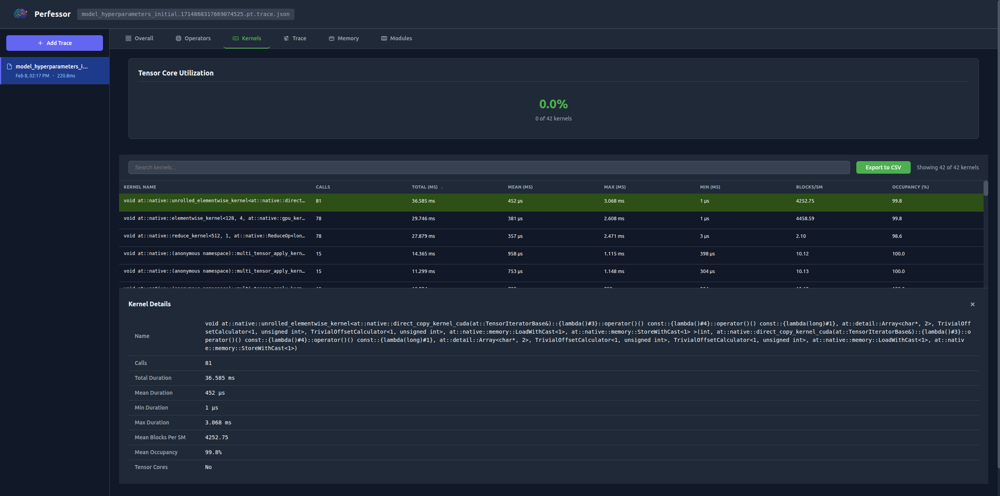<br/>
        <b>Kernels View Details</b>
      </td>
    </tr>
    <tr>
      <td align="center">
        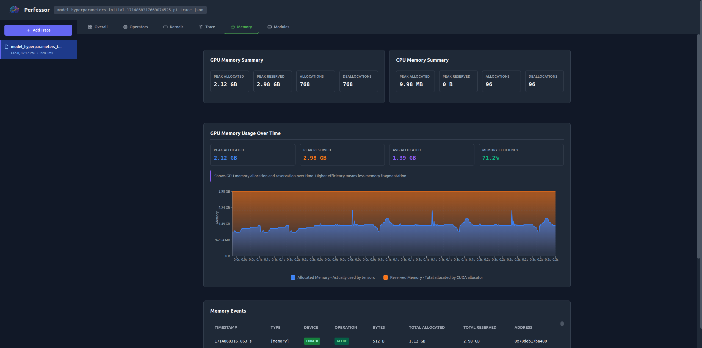<br/>
        <b>Memory View</b>
      </td>
      <td align="center">
        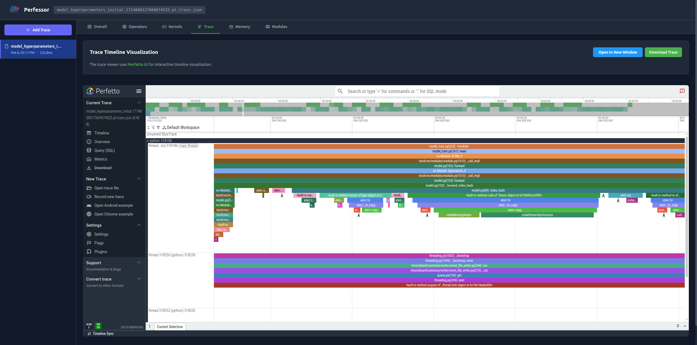<br/>
        <b>Trace View</b>
      </td>
    </tr>
  </table>
</div>

### NCU Report Demo

<div align="center">
  
</div>

### NCU Report Screenshots

<div align="center">
  <table>
    <tr>
      <td align="center">
        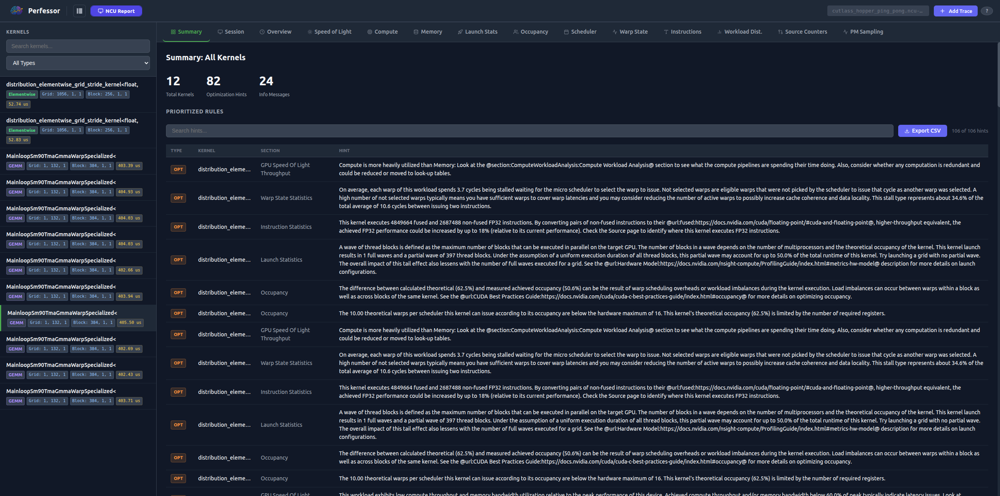<br/>
        <b>NCU Summary</b>
      </td>
      <td align="center">
        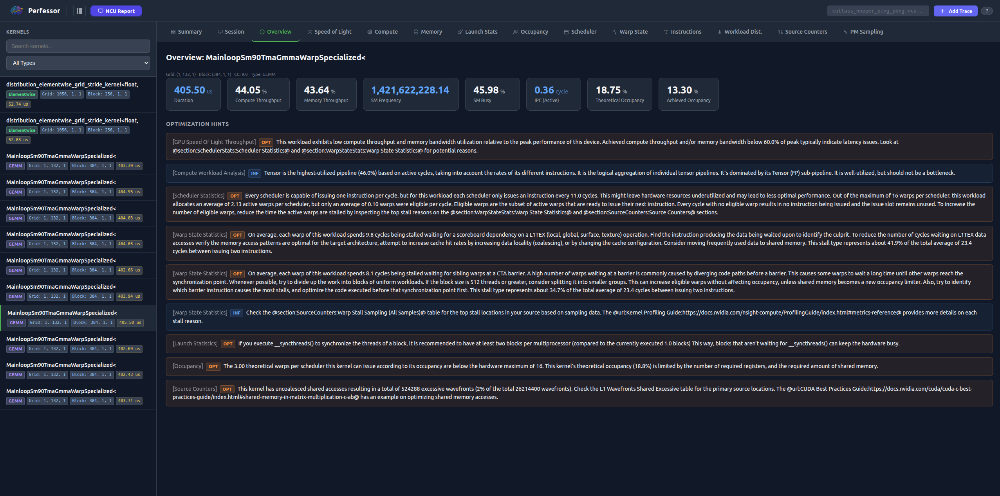<br/>
        <b>NCU Kernel Detail</b>
      </td>
    </tr>
    <tr>
      <td align="center">
        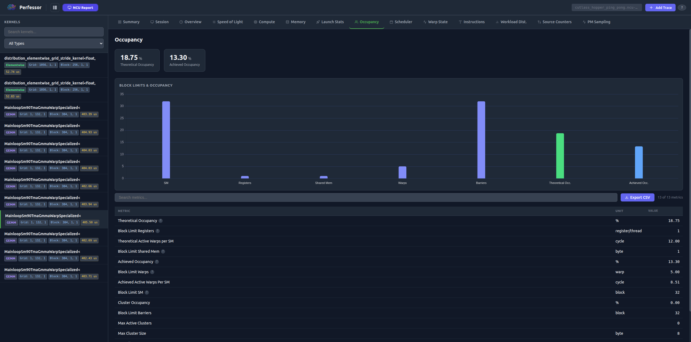<br/>
        <b>NCU Memory Analysis</b>
      </td>
      <td align="center">
        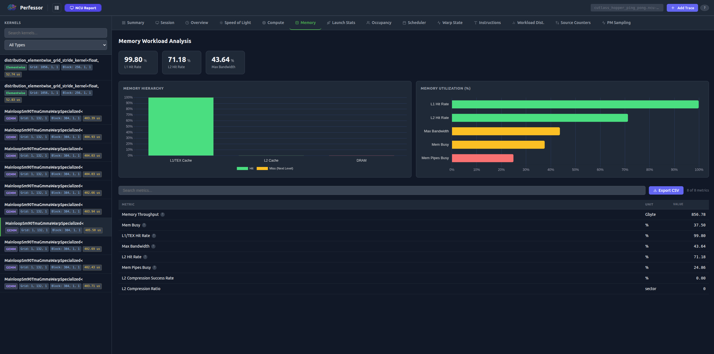<br/>
        <b>NCU Occupancy Analysis</b>
      </td>
    </tr>
  </table>
</div>

---

## Features

### PyTorch Profiler Trace Analysis

#### 🎯 Core Capabilities
- **Multiple Trace Support**: Load and switch between multiple trace files
- **Gzip Support**: Upload compressed `.json.gz` files for smaller transfers
- **Large File Handling**: Process files up to 1GB with chunked reading and Web Workers
- **Behavior Match**: Precisely matches torch-tb-profiler metrics and filtering

#### 📊 Overview View
- Summary cards: total duration, event count, unique operators, GPU kernels
- GPU information: device name, memory, compute capability
- GPU utilization gauge and step time breakdown chart
- Automated performance recommendations and bottleneck detection
- Tensor Core utilization statistics

#### ⚙️ Operators View
- Exact operator filtering matching torch-tb-profiler
- Sortable device/host self/total durations, calls, percentage breakdown
- Real-time debounced search and virtualized scrolling for 1000+ operators
- Interactive detail panel per operator; CSV export

#### 🔧 Kernels View
- Weighted averages by duration matching torch-tb-profiler exactly
- Tensor Core detection ("TC" badges), occupancy, blocks per SM
- Interactive detail panel per kernel; search and CSV export

#### 📈 Trace View (Perfetto UI)
- Embedded Perfetto timeline with thread/stream lanes, zoom/pan, flow events
- Open in new window or download the trace file

#### 💾 Memory View
- Allocation/deallocation tracking and memory usage over time

---

### NVIDIA Nsight Compute Report Analysis

#### 🎯 Core Capabilities
- **Client-side parsing**: `.ncu-rep` binary files parsed entirely in the browser — no server needed
- **Kernel browser**: Searchable and filterable sidebar with kernel type, grid/block dimensions, duration
- **10 analysis sections**: All major NCU sections rendered with charts and metric tables
- **Optimization hints**: OPT and INF hints surfaced per kernel and in a global summary
- **CSV export**: Export metric tables from any section

#### 📋 Kernel Sidebar
- Kernel list with type classification (GEMM, Conv, Reduce, Elementwise, Softmax, Attention, Memory, etc.)
- Colored type badges, grid/block dimension tags, duration
- Real-time search by kernel name or type

#### 📑 Analysis Sections (per kernel)
1. **Summary** — Key metrics (duration, compute/memory throughput, SM busy, occupancy, IPC) + all optimization hints
2. **GPU Speed of Light** — Throughput bars (compute, memory, L1, L2) + roofline visualization
3. **Compute Workload** — SM busy, issue slots busy, IPC metrics
4. **Memory Workload** — Memory hierarchy (L1→L2→DRAM) with hit/miss rates, transaction breakdown
5. **Launch Statistics** — Grid/block size, registers, shared memory, waves per SM
6. **Occupancy** — Theoretical vs achieved, block limit factors (registers, shared mem, warps)
7. **Scheduler Statistics** — Eligible warp distribution, issued/active warps
8. **Warp State Statistics** — Stall reason breakdown (memory, execution dependency, sync, etc.)
9. **Instruction Statistics** — Per-opcode instruction mix
10. **Source Counters** — Per-source-line performance counters (when available)

#### 💡 Hint System
- **OPT** (orange): Actionable optimization suggestions
- **INF** (blue): Informational context
- Global summary table aggregates hints across all kernels, sortable by type and section

---

## Getting Started

### Prerequisites
- Node.js 18+ and npm

### Installation

```bash
git clone <your-repo-url>
cd perfessor
npm install
npm run dev
```

The application will be available at `http://localhost:5173`

### Build for Production

```bash
npm run build
npm run preview
```

### Deploy to GitHub Pages

The app is configured to deploy to GitHub Pages on every push to `main` via GitHub Actions:

1. Builds to the `docs/` folder
2. Uploads the build artifact
3. Deploys to GitHub Pages

To enable: go to repository Settings → Pages → set Source to "GitHub Actions".

---

## Usage

### PyTorch Profiler Trace

#### 1. Generate a Trace

```python
import torch
import torch.nn as nn
import torch.profiler as profiler

model = nn.Sequential(
    nn.Linear(10, 100),
    nn.ReLU(),
    nn.Linear(100, 10)
).cuda()

x = torch.randn(32, 10).cuda()

with profiler.profile(
    activities=[
        profiler.ProfilerActivity.CPU,
        profiler.ProfilerActivity.CUDA,
    ],
    record_shapes=True,
    profile_memory=True,
    with_stack=True,
) as prof:
    model(x)

prof.export_chrome_trace("trace.json")
```

**📚 More info**: [PyTorch Profiler Recipe](https://docs.pytorch.org/tutorials/recipes/recipes/profiler_recipe.html)

**⚠️ Large Files (>1GB)**: Use the `schedule` parameter to profile fewer steps, or split the trace into smaller segments.

#### 2. Upload & Analyze

- Drag and drop `.json`, `.pt.trace.json`, or `.json.gz` files
- **Navigate views** with icon tabs or keyboard shortcuts:
  - `1` — Overview
  - `2` — Operators
  - `3` — Kernels
  - `4` — Trace
  - `5` — Memory

---

### NVIDIA Nsight Compute Report

#### 1. Generate an NCU Report

```bash
# Profile with full kernel metrics
ncu --set full -o report ./your_cuda_application

# Profile specific kernels
ncu --kernel-name "myKernel" --set full -o report ./app

# Profile a Python script
ncu --set full -o report python train.py
```

This produces a `report.ncu-rep` file.

**📚 More info**: [NCU CLI Reference](https://docs.nvidia.com/nsight-compute/NsightComputeCli/index.html)

#### 2. Upload & Analyze

- Drag and drop your `.ncu-rep` file (or click "Add File")
- The kernel sidebar populates automatically
- Click any kernel to open its full metric view
- Switch tabs to explore different analysis sections
- Hover metric cards for inline descriptions

---

## Architecture

### Technology Stack

| Component | Technology |
|-----------|-----------|
| UI Framework | React 19 |
| Build Tool | Vite 7.3 |
| State Management | Zustand |
| PyTorch Charts | Recharts 3.7 |
| NCU Charts | Chart.js 4.5 |
| Tables | TanStack Table v8 + Virtual v3 |
| Utilities | D3 Scale/Color |
| Trace Viewer | Perfetto UI |
| NCU Parsing | Custom protobuf decoder (no external deps) |

### Component Structure

```
src/
├── App.jsx                        # Mode switcher (PyTorch Trace ↔ NCU Report)
├── components/
│   ├── FileUploader.jsx           # Landing page, routes files by type
│   ├── AddTraceButton.jsx         # Add additional files + help popup
│   ├── TraceViewer.jsx            # PyTorch trace tab navigation
│   ├── TraceSelector.jsx          # Trace file switcher sidebar
│   ├── UpdateBanner.jsx           # Auto version check banner
│   ├── overview/                  # PyTorch Overview view
│   ├── operator/                  # PyTorch Operators view
│   ├── kernel/                    # PyTorch Kernels view
│   ├── trace/                     # Perfetto timeline view
│   ├── memory/                    # Memory events view
│   └── ncu/
│       ├── NcuView.jsx            # NCU layout (sidebar + detail)
│       ├── NcuKernelSidebar.jsx   # Kernel list with search/filter
│       ├── NcuKernelDetail.jsx    # Tab bar and section routing
│       ├── NcuChart.jsx           # React wrapper for Chart.js (useRef/useEffect)
│       ├── NcuShared.jsx          # MetricsTable, HintBox, MetricCard
│       └── tabs/                  # One file per analysis section tab
├── store/
│   ├── traceStore.js              # PyTorch trace state (Zustand)
│   └── ncuStore.js                # NCU report state (Zustand)
└── utils/
    ├── traceDataProcessor.js      # PyTorch trace parsing and aggregation
    ├── ncuParser.js               # .ncu-rep binary protobuf parser
    ├── ncuHelpers.js              # Metric formatting helpers
    ├── ncuCharts.js               # Chart.js chart factories
    ├── ncuMetricDescriptions.js   # Metric tooltip text
    ├── recommendationsEngine.js   # PyTorch performance hints
    ├── eventClassifier.js
    ├── memoryTracker.js
    └── formatters.js
```

### PyTorch Data Processing Pipeline

1. File upload & validation (type, size, gzip detection)
2. Automatic gzip decompression (DecompressionStream API)
3. Chunked reading in 10MB segments with progress tracking
4. Web Worker background processing
5. JSON parsing and event conversion (B/E → X events)
6. Metadata extraction (GPU info, process/thread names)
7. O(n) hierarchy building and self-time calculation
8. Operator aggregation (exact torch-tb-profiler logic)
9. Kernel analysis (weighted averages, Tensor Core detection)
10. Step time breakdown and recommendations generation

---

## NCU Binary Format (.ncu-rep)

The `.ncu-rep` file is NVIDIA's proprietary binary format based on Protocol Buffers v2. Perfessor parses it entirely client-side using a hand-written wire format decoder with no external protobuf library.

**Official docs**: [Nsight Compute Documentation](https://docs.nvidia.com/nsight-compute/)

### File Structure

```mermaid
flowchart TD
    FILE["📁 .ncu-rep File"]

    FILE --> MAGIC["Magic Header<br/>0x4E 0x56 0x52 0x00<br/>'NVR\0' — 4 bytes"]
    FILE --> FHDR["FileHeader<br/>──────────────<br/>4-byte LE size<br/>+ protobuf payload<br/>──────────────<br/>Field 1: Version (uint32)"]
    FILE --> BLOCKS["Blocks (repeated)"]

    BLOCKS --> BLK0["Block 0"]
    BLOCKS --> BLK1["Block 1"]
    BLOCKS --> BLKN["Block N..."]

    BLK0 --> BHDR["BlockHeader<br/>──────────────<br/>4-byte LE size<br/>+ protobuf payload<br/>──────────────<br/>Field 1: NumSources<br/>Field 2: NumResults<br/>Field 3: SessionDetails<br/>Field 4: StringTable<br/>Field 5: PayloadSize<br/>Field 7: NumRangeResults"]
    BLK0 --> PAYLOAD["Payload (PayloadSize bytes)"]

    PAYLOAD --> SOURCES["Source Entries × NumSources<br/>──────────────<br/>4-byte LE size<br/>+ ProfileSource protobuf"]
    PAYLOAD --> RESULTS["Profile Results × NumResults<br/>──────────────<br/>4-byte LE size<br/>+ ProfileResult protobuf<br/>⬇ KERNEL DATA"]
    PAYLOAD --> RANGES["Range Results × NumRangeResults<br/>──────────────<br/>4-byte LE size<br/>+ RangeResult protobuf"]

    RESULTS --> PR["ProfileResult<br/>──────────────<br/>Field  5: mangled name<br/>Field  6: function name<br/>Field  7: demangled name<br/>Field 10: grid (Uint64x3)<br/>Field 11: block (Uint64x3)<br/>Field 13: MetricResults[]<br/>Field 17: Sections[]<br/>Field 19: RuleResults[]<br/>Field 22: contextId<br/>Field 23: streamId"]

    PR --> MR["ProfileMetricResult<br/>──────────────<br/>Field 1: NameId → StringTable[i]<br/>Field 2: MetricValue"]
    PR --> SEC["ProfilerSection<br/>──────────────<br/>Field 1: identifier<br/>Field 2: displayName<br/>Field 3: order<br/>Field 4: Header → metrics[]"]
    PR --> RR["RuleResult<br/>──────────────<br/>Field 1: identifier<br/>Field 2: displayName<br/>Field 3: Body → messages[]<br/>Field 4: sectionIdentifier"]

    MR --> MV["ProfileMetricValue (oneof)<br/>──────────────<br/>Field 1: string  (LENGTH_DELIMITED)<br/>Field 2: float   (FIXED32)<br/>Field 3: double  (FIXED64)<br/>Field 4: uint32  (VARINT)<br/>Field 5: uint64  (VARINT)"]

    RR --> RM["RuleResultMessage<br/>──────────────<br/>Field 1: message text<br/>Field 2: type<br/>1 = INF (blue)<br/>4 = OPT (orange)"]

    BHDR --> ST["StringTable<br/>──────────────<br/>'Duration'<br/>'SM Busy'<br/>'L1 Hit Rate'<br/>...<br/>(carried across blocks)"]
    MR -. "NameId resolves via" .-> ST

    style MAGIC fill:#1e3a5f,stroke:#3b82f6
    style FHDR fill:#1e3a5f,stroke:#3b82f6
    style BHDR fill:#1e3a5f,stroke:#3b82f6
    style PAYLOAD fill:#1a3a2a,stroke:#22c55e
    style RESULTS fill:#2d1f3f,stroke:#a855f7
    style PR fill:#2d1f3f,stroke:#a855f7
    style MR fill:#3a2a1a,stroke:#f59e0b
    style MV fill:#3a2a1a,stroke:#f59e0b
    style SEC fill:#3a2a1a,stroke:#f59e0b
    style RR fill:#3a1a1a,stroke:#ef4444
    style RM fill:#3a1a1a,stroke:#ef4444
    style ST fill:#1a3a3a,stroke:#06b6d4
```

### Protocol Buffer Wire Types

| Wire Type | Value | Encoding | Used For |
|-----------|-------|----------|----------|
| VARINT | 0 | Variable-length, 7 bits per byte | int32, int64, uint32, uint64, bool, enum |
| FIXED64 | 1 | 8 bytes, little-endian | fixed64, double |
| LENGTH_DELIMITED | 2 | varint length + bytes | string, bytes, nested messages, packed repeated |
| FIXED32 | 5 | 4 bytes, little-endian | fixed32, float |

**Varint example:** `300` → `0xAC 0x02` — last 7 bits of each byte form the value; MSB=1 means more bytes follow.

### Proto Schema Files

Located in your NCU installation at `$NSIGHT_COMPUTE_ROOT/extras/FileFormat/*.proto`:

- `ProfilerReport.proto` — FileHeader, BlockHeader, top-level structure
- `ProfilerResultsCommon.proto` — ProfileMetricValue, ProfileMetricResult, Uint64x3
- `ProfilerSection.proto` — ProfilerSection, ProfilerSectionMetric, ProfilerSectionHeader
- `ProfilerStringTable.proto` — String table for metric name deduplication

> **Note:** The file format can change between NCU versions without notice.

### ProfileResult Fields (per kernel launch)

| Field # | Type | Description |
|---------|------|-------------|
| 5 | string | Mangled kernel name |
| 6 | string | Short function name |
| 7 | string | Demangled (human-readable) kernel name |
| 10 | Uint64x3 | Grid dimensions (X, Y, Z) |
| 11 | Uint64x3 | Block dimensions (X, Y, Z) |
| 12 | repeated SourceLine | SASS/PTX source lines (**removed in NCU 2025+**) |
| 13 | repeated ProfileMetricResult | Collected performance metrics |
| 17 | repeated ProfilerSection | Organized metric sections |
| 19 | repeated RuleResult | Optimization hints and warnings |
| 22 | uint32 | CUDA context ID |
| 23 | uint32 | CUDA stream ID |

### ProfileMetricValue Encoding

Each metric value is a oneof with five possible types:

| Field # | Type | Wire Type |
|---------|------|-----------|
| 1 | string | LENGTH_DELIMITED |
| 2 | float | FIXED32 |
| 3 | double | FIXED64 |
| 4 | uint32 | VARINT |
| 5 | uint64 | VARINT |

The parser checks fields 1→5 in order and returns the first non-null value.

### String Table and Metric Name Resolution

Metric names can be 50+ characters and repeat thousands of times. NCU deduplicates them via a per-block string table:

```
BlockHeader.StringTable: ["Duration", "SM Busy", "L1 Hit Rate", ...]

ProfileMetricResult:
  NameId: 2        → resolves to "L1 Hit Rate"
  MetricValue: { double: 87.5 }
```

String tables persist across blocks — if a block has an empty table it reuses the previous block's table. This allows later blocks to reference earlier string tables.

### Device Attributes

Device information is stored as metrics in the first `ProfileResult`, not in a dedicated structure:

- `device__attribute_display_name` — GPU model name
- `device__attribute_compute_capability_major/minor` — SM version
- `device__attribute_multiprocessor_count` — Number of SMs
- `device__attribute_global_memory_size` — Total VRAM
- `device__attribute_l2_cache_size` — L2 cache size
- `device__attribute_gpu_core_clock_rate` — Core clock
- `device__attribute_memory_clock_rate` — Memory clock
- `device__attribute_max_threads_per_block` — Block limits
- `device__attribute_max_shared_memory_per_block` — Shared mem limit
- `device__attribute_max_registers_per_block` — Register limit

### Rule Results (Optimization Hints)

```protobuf
message RuleResult {
  string Identifier = 1;         // e.g., "SOL_DRAM_Bound"
  string DisplayName = 2;        // e.g., "Memory Bound"
  RuleResultBody Body = 3;       // Contains the hint messages
  string SectionIdentifier = 4;  // Which section this belongs to
}

message RuleResultMessage {
  string Message = 1;  // The hint text
  int32 Type = 2;      // 0=None, 1=Info, 2=Warn, 3=Error, 4=Optimization
}
```

Perfessor surfaces Type 4 as **OPT** (orange) and Type 1 as **INF** (blue).

### Metric Value Formatting

The parser applies name-pattern heuristics to pick units and formatting:

| Pattern | Unit | Example |
|---------|------|---------|
| `.pct`, `_pct`, `pct_of_peak` | % | `sm__throughput.avg.pct_of_peak_sustained_elapsed` → "45.2%" |
| `time_duration` | ns/us/ms/s | `sm__duration.avg` → "1.23 ms" |
| `clock_rate`, `frequency` | Hz/MHz/GHz | `device__attribute_gpu_core_clock_rate` → "1.41 GHz" |
| `_bytes`, `_size` | B/KB/MB/GB | `device__attribute_global_memory_size` → "16.00 GB" |
| `per_cycle` | inst/cycle | `sm__inst_executed.avg.per_cycle_active` → "2.45 inst/cycle" |
| `warp` | warp | `sm__warps_active.avg` → "32.5 warp" |
| `thread_count` | thread | `launch__thread_count` → "256 thread" |

### Parser Design

Key decisions in `src/utils/ncuParser.js`:

1. **No protobuf library** — hand-written wire format decoder keeps bundle size minimal
2. **BigInt throughout** — faithful 64-bit integer handling for timestamps and counters
3. **Streaming block-by-block** — processes files without loading everything into memory at once
4. **String table carry-forward** — correctly handles multi-block files where later blocks omit the table

---

## Performance Recommendations Engine (PyTorch)

| Issue | Detection | Suggestion |
|-------|-----------|------------|
| DataLoader bottleneck | DataLoader time > 10% of total | Increase `num_workers`, enable `pin_memory=True` |
| GPU underutilization | GPU utilization < 50% | Increase batch size, use mixed precision |
| High communication overhead | Comms > 20% (distributed) | Use gradient accumulation, optimize network topology |
| Tensor Core underutilization | <50% eligible kernels use TCs | Use `torch.cuda.amp` for mixed precision |
| Memory inefficiency | High memory fragmentation | Use memory-efficient training techniques |

---

## Performance Optimizations

- **Web Worker Processing**: Heavy PyTorch trace computation runs off the main thread
- **Chunked File Reading**: 10MB chunks prevent browser freezing on large files
- **Gzip Support**: Automatic decompression via DecompressionStream API
- **O(n) Algorithms**: Optimized hierarchy building and self-time calculation
- **Lazy Loading**: NCU viewer loaded on-demand with `React.lazy()`
- **Virtualized Tables**: Only visible rows rendered (TanStack Virtual)
- **Debounced Search**: 300ms debounce for smooth filtering

---

## Keyboard Shortcuts

- `1`–`5`: Switch between PyTorch Trace views
- `Ctrl+F`: Focus search (when available)
- `Esc`: Close detail panels

---

## Browser Support

- Chrome/Edge 90+
- Firefox 88+
- Safari 14+

---

## References

### PyTorch Profiling
- [PyTorch Kineto TensorBoard Plugin](https://github.com/pytorch/kineto/tree/main/tb_plugin)
- [PyTorch Profiler Tutorial](https://docs.pytorch.org/tutorials/intermediate/tensorboard_profiler_tutorial.html)
- [PyTorch Profiler Recipe](https://docs.pytorch.org/tutorials/recipes/recipes/profiler_recipe.html)
- [Chrome Trace Event Format](https://docs.google.com/document/d/1CvAClvFfyA5R-PhYUmn5OOQtYMH4h6I0nSsKchNAySU/)

### NVIDIA Nsight Compute
- [Nsight Compute Homepage](https://developer.nvidia.com/nsight-compute)
- [Nsight Compute Documentation](https://docs.nvidia.com/nsight-compute/)
- [Profiling Guide](https://docs.nvidia.com/nsight-compute/ProfilingGuide/index.html)
- [NCU CLI Reference](https://docs.nvidia.com/nsight-compute/NsightComputeCli/index.html)
- [Python Report Interface](https://docs.nvidia.com/nsight-compute/PythonReportInterface/index.html)

### Protocol Buffers
- [Encoding Guide](https://protobuf.dev/programming-guides/encoding/)
- [Proto2 Language Guide](https://protobuf.dev/programming-guides/proto2/)

### Visualization
- [Perfetto UI](https://ui.perfetto.dev/)
- [CUDA C++ Programming Guide](https://docs.nvidia.com/cuda/cuda-c-programming-guide/)

---

## Contributing

Contributions welcome!

---

> **Note:** This is an unofficial tool not affiliated with NVIDIA or Meta/PyTorch. For official support, use NVIDIA Nsight Compute or PyTorch's built-in profiling tools.
